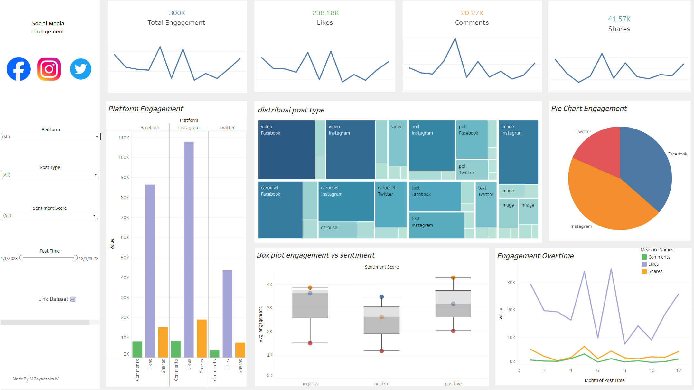

#  📊 Tableau_SocialMediaEngagementDashboard

Dashboard ini memvisualisasikan performa konten dari berbagai platform media sosial seperti **Instagram**, **Twitter**, dan **Facebook** berdasarkan engagement, jenis posting, waktu publikasi, dan sentimen.

# 📊 Social Media Engagement Dashboard

An interactive Tableau dashboard that visualizes social media engagement performance across **Instagram**, **Twitter**, and **Facebook**, based on post type, sentiment, date, and user interactions such as likes, comments, and shares.

## 🔗 Live Dashboard
👉 [View on Tableau Public](https://public.tableau.com/views/SocialMediaEngagementDashboard_17521361630400/Dashboard1?:language=en-US&publish=yes&:sid=&:redirect=auth&:display_count=n&:origin=viz_share_link)  

## 📁 Dataset
Source: [Kaggle - Social Media Engagement Dataset](https://www.kaggle.com/datasets/divyaraj2006/social-media-engagement)

## 💡 Key Features
- **KPI Cards**: Total Engagement, Likes, Comments, Shares
- **Platform Engagement**: Compare performance across Instagram, Twitter, and Facebook
- **Post Type Distribution**: Bar chart breakdown of post types (Image, Video, etc.)
- **Box Plot - Engagement vs Sentiment**: See the variation of engagement based on sentiment polarity
- **Pie Chart of Engagement**: Proportional breakdown by platform or post type
- **Line Chart - Engagement Over Time**: Monthly trend visualization using a date slider
- **Interactive Filters**: Platform, Sentiment, Post Type, and Date Range
- **Date Slider** with month-level granularity
- **Clickable Icons & Hyperlinks** for external navigation
- Clean, minimalist layout optimized for desktop viewing

## 🔍 Sample Insights
- Engagement peaked during **May** and **July**
- **Positive sentiment** posts perform better in terms of user engagement
- **Instagram** leads in engagement total

## 🚀 How to Use
1. Open the dashboard via the Tableau Public link above
2. Use the filter controls (dropdowns and slider) to interact with the data
3. Hover for tooltips or click links/icons to explore more

## 🖼️ Dashboard Preview
  

## 👤 Author
**M. Zoyadzakaria W**  

---

